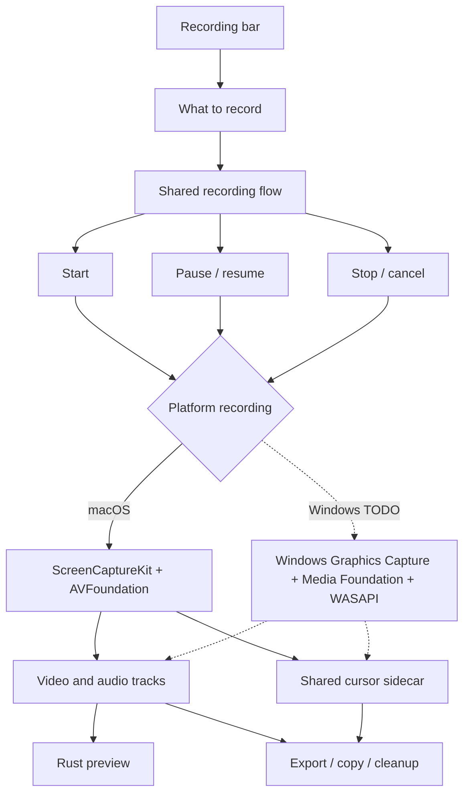
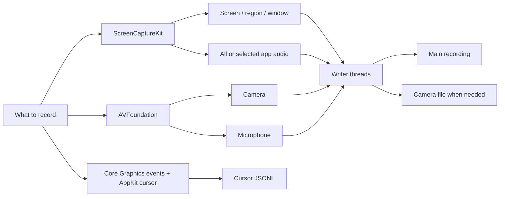

<!--
SPDX-FileCopyrightText: 2026 overpolish
SPDX-License-Identifier: GPL-3.0-or-later
-->

# Recording

## Shared

There is one recording flow for both platforms. It handles:

- modes and selected sources
- start, pause, resume, stop and cancel
- recording state
- working files and cleanup
- timing and export info

The platform part only needs to provide:

- `begin_blocking(config)` to start capture
- `CaptureSession` with pause, resume, stop and cancel
- `CaptureStart` with the first written frame, shared clock, source scale and cursor bounds

The platform is picked at compile time. It is not a plugin system.

## macOS

- Screen, region and window use ScreenCaptureKit.
- System audio and selected app audio use ScreenCaptureKit, including audio only mode.
- Camera and microphone use AVFoundation.
- AVAssetWriter writes the files and uses hardware video encoding.
- Camera stays separate unless bake in is enabled on export.
- Microphone stays on its own track so it is easy to edit later.
- Cursor position, appearance and button changes use the same recording clock as the media writers. Pauses are removed once in the shared cursor writer.
- Cursor files use global logical coordinates and include the captured source bounds. The macOS part only translates native events and cursor styles into the shared format.
- macOS stops every ScreenCaptureKit stream when the Mac locks or sleeps. `platform/stream_recovery.rs` keeps each stream's recipe and rebuilds and restarts a stopped one about once a second until it runs again, so video resumes after unlock on the same timeline. The time on the lock screen holds the last frame; time asleep is not on the clock at all.

## Replay buffer

The replay buffer keeps the last 30 seconds of whatever the recording bar was set to when it was turned on: screen, region, window, camera or audio, with system audio, microphone and camera as selected. It runs beside recordings, not as one: the bar, dock and recording state never see it, and a recording can start and stop while it runs. Changing the bar afterwards sets up the next recording, not the buffer.

- `recording/replay.rs` owns the on/off state, saving and the `replay://state` event. It is driven from the bar's toggle, the tray and the Save Replay shortcut, which is only registered while the buffer is on. While it runs the tray shows a rewind mark over its arc, unless a recording or a Delayed Screenshot countdown has something to show.
- The macOS capture opens the same streams a recording does (`platform/startup.rs` with `Sink::Replay`). Its writers (`platform/replay/`) encode video with their own VideoToolbox sessions and keep the encoded frames back to the keyframe a full-length clip must start from; audio is kept as PCM and encoded only when a clip is saved. A quiet screen is re-encoded as a keyframe every second so a clip never reaches back to its last change.
- A save holds what happened since the previous save, capped at 30 seconds. The save encodes the last frame again as a keyframe at the moment of the save, which ends that clip and is exactly where the next one starts. A camera beside the screen forces its keyframes right after the screen's so both start together. Turning the buffer off forgets where the last save ended.
- Cursor and keyboard keep their recent records in memory (`sidecar_output.rs`) and live annotations keep their recent visible spans; a clip restates the cursor, held buttons and keys, and annotations already on screen at its first frame.
- A saved clip is written as an ordinary working recording and opened in the editor, so it cannot be saved while the editor holds an unsaved recording.
- Windows has no replay buffer yet; the bar hides the toggle there.

## Windows

Windows recording is TODO. It will use the same shared flow and implement the platform part with:

- Windows Graphics Capture for screen, region and window
- Media Foundation for camera and hardware encoding
- WASAPI for microphone, system audio and app audio
- Raw Input plus Win32 cursor inspection for the shared cursor format

The recording bar, recording state and export UI should not need Windows versions.
