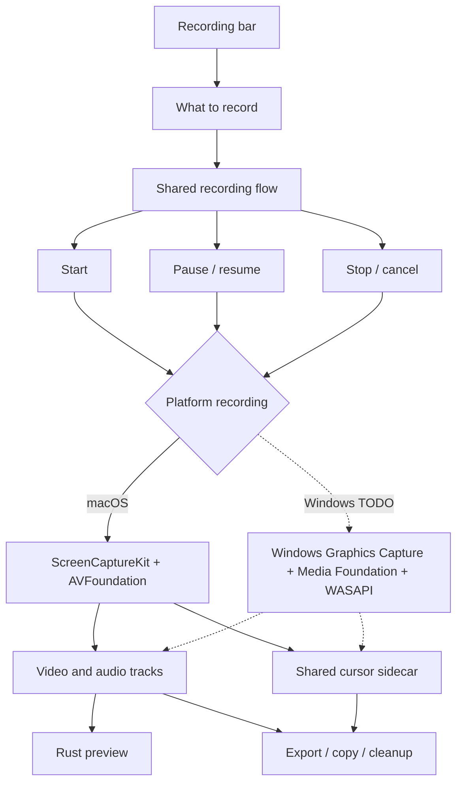
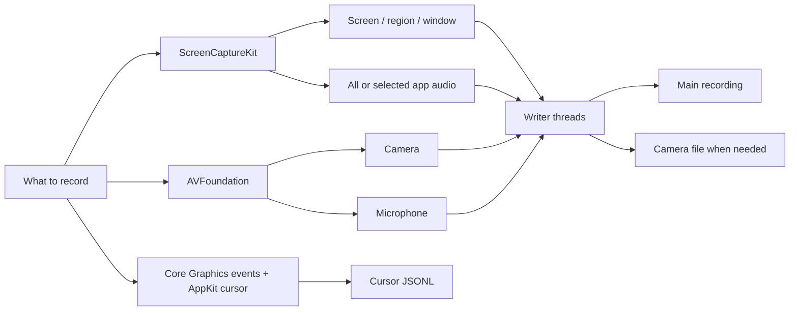

<!--
SPDX-FileCopyrightText: 2026 overpolish
SPDX-License-Identifier: GPL-3.0-or-later
-->

# Recording

## Shared

There is one recording flow for both platforms. It handles:

- modes and selected sources
- start, pause, resume, stop and cancel
- recording state
- the project each recording is written into
- timing and export info

### Projects

Every recording is a project: a folder in the projects folder (Settings, or `Movies/Screenwide` on macOS and `Videos\Screenwide` on Windows) named after the moment it started. Capture writes the movie, camera, cursor and keyboard tracks straight into its `media/` folder, and `session/begin.rs` writes the `<title>.screenwide` manifest as soon as the capture runs, so a project survives the app dying mid-recording and opens like any other. Stopping rewrites the manifest with the tracks that were actually written; the editor then saves its edit and its look (canvas, cursor, keyboard overlay, camera bubble, tracks and volumes) into the same manifest as they change, so a project reopens exactly as it was left (`src-tauri/src/project.rs`, `editor/project_look.rs`). A background picture the look shows and the pictures its images show are copied into `media/pictures/`, and opening or closing the project removes the ones it no longer uses (`project_look/cleanup.rs`). The editor also keeps `preview.png` beside the manifest, the edited frame the project browser shows. Exporting copies out of the project and leaves it as it was, unless the export window's "Delete project after saving" is ticked: then the project goes to the Trash once the files are written. A new recording can start while another is open, since the open one is already saved. Discarding a recording marks its folder cancelled before teardown and deletes it after; a launch finishes any deletion the previous run did not.

Screenshots are projects too (`editor/screenshot_project.rs`): the first capture makes one, each capture taken while the screenshot editor is open is added to it as another layer, and closing the editor keeps it. Captures copied to the clipboard alone make none.

A project's name is its folder's and its manifest's. Renaming one that no editor has open renames both at once. One open in an editor cannot be renamed under it, since the editor holds its files and Windows will not rename a folder holding an open file: the new name is kept in the manifest's `title` and shown everywhere at once, and the folder and manifest take it when the editor lets the project go (closing, a finished export or copy, or another project opened in its place), or when it is next opened if the app stopped first (`editor/project_name.rs`).

The app owns the `.screenwide` type (`bundle.fileAssociations`, and `scripts/macos-dev-info.plist` for the dev bundle), so double-clicking a manifest opens its project in the editor for its kind, in place of whatever that editor had open. macOS delivers the file as an open event (`startup::open_files`); Windows passes it as a launch argument, and the single-instance plugin hands a second launch's arguments to the running app. Open Project in the tray picks one by hand.

The platform part only needs to provide:

- `begin_blocking(config)` to start capture
- `CaptureSession` with pause, resume, stop and cancel
- `CaptureStart` with the first written frame, shared clock, source scale and cursor bounds

The platform is picked at compile time. It is not a plugin system.

### Inputs and failures

A start never goes ahead without an input the user chose. Before the countdown, `session/inputs.rs` checks that the selected microphone still exists and that the selected camera still offers the exact size and rate asked for, and fails the start if either is gone; the replay buffer runs the same check. The camera answer comes from `recording_inputs/camera_mode.rs`, which uses the lookups the camera start itself makes (`camera_format::resolve_exact_camera_format` on Windows, `camera_frame_rate::find_format` on macOS), and the recording bar polls the same reader through `get_camera_mode_status`, so the warning on the camera control and the start cannot disagree. A warned control explains itself in the native tooltip window, since the bar's own window is too short for an in-page tooltip.

Failures the user has to hear about go through `session::report_failure` and `replay::report`, which emit the usual error events and put the message in the app-drawn alert (`src-tauri/src/alert.rs`). It is one window, reused: it belongs to no other window, centres on the display under the pointer and stays out of every capture. Alerts that arrive while one is showing wait their turn, and one identical to an alert already showing or waiting is dropped, so retrying a start that keeps failing for the same reason leaves a single alert. Rejections by the state machine, such as a second Stop, only emit the event.

Debug builds can fake each failure with `SCREENWIDE_FAULT` (`fault.rs`): `pnpm dev:recording-failures camera-mode,stop` runs the app with the camera mode reading as gone and stopping failing. The names are `camera-mode`, `microphone`, `recording-start`, `capture`, `stop` and `replay-start`. Release builds compile it out.

## macOS

- Screen, region and window use ScreenCaptureKit.
- System audio and selected app audio use ScreenCaptureKit, including audio only mode.
- Camera and microphone use AVFoundation.
- AVAssetWriter writes the files and uses hardware video encoding.
- Camera stays separate unless bake in is enabled on export.
- Microphone stays on its own track so it is easy to edit later.
- Cursor position, appearance and button changes use the same recording clock as the media writers. Pauses are removed once in the shared cursor writer.
- Cursor files use global logical coordinates and include the captured source bounds. The macOS part only translates native events and cursor styles into the shared format.
- macOS stops every ScreenCaptureKit stream when the Mac locks or sleeps. `platform/stream_recovery.rs` keeps each stream's recipe and rebuilds and restarts a stopped one about once a second until it runs again, so video resumes after unlock on the same timeline. The time on the lock screen holds the last frame.

## Sleep

`recording/sleep.rs` decides what capture does when the computer sleeps, on every platform; `sleep/platform_*.rs` only report the moment (NSWorkspace notifications on macOS, the power manager's suspend and resume callback on Windows). A running recording is paused as if the user had pressed Pause and stays paused after the wake; a recording still counting down is discarded. The replay buffer turns off and, once the computer wakes, back on with the settings it had (`replay/sleep.rs`). Locking without sleeping changes nothing.

## Replay buffer

The replay buffer keeps the last 30 seconds of whatever the recording bar was set to when it was turned on: screen, region, window, camera or audio, with system audio, microphone and camera as selected. It runs beside recordings, not as one: the bar, dock and recording state never see it, and a recording can start and stop while it runs. Changing the bar afterwards sets up the next recording, not the buffer.

- `recording/replay.rs` owns the on/off state, saving and the `replay://state` event. It is driven from the bar's toggle, the tray and the Save Replay shortcut, which is only registered while the buffer is on. The tray's Turn On item emits `replay://start-requested` to the recording bar, which starts the buffer with its current settings exactly as its toggle does, because only the bar's webview holds them. When the bar's readiness check rejects those settings, or Rust rejects the start or the capture fails, the bar shows itself, and its input warnings say what stopped it. While it runs the tray shows a rewind mark over its arc, unless a recording or a Delayed Screenshot countdown has something to show.
- The macOS capture opens the same streams a recording does (`platform/startup.rs` with `Sink::Replay`). Its writers (`platform/replay/`) encode video with their own VideoToolbox sessions and keep the encoded frames back to the keyframe a full-length clip must start from; audio is kept as PCM and encoded only when a clip is saved. A quiet screen is re-encoded as a keyframe every second so a clip never reaches back to its last change.
- The Windows capture opens the same streams through `platform_windows/startup.rs` with a replay length. Its writers (`platform_windows/replay/`) convert each frame to NV12 on the GPU and drive the H.264 encoder transform directly, hardware first with Microsoft's software encoder as the fallback, because the Sink Writer never hands encoded samples back. Frames are encoded at no more than the capture's frame rate, the newest one winning. Microphone and system audio go to in-memory rings (`platform_windows/audio/ring.rs`) instead of sidecars. A save writes the clip's frames to an MP4 through the Sink Writer in passthrough, which keeps every frame's own time, then writes the audio stretch as raw sidecars and muxes it exactly as a recording's audio is muxed. An encoder that ignores keyframe requests is restarted for the keyframes a save and a quiet screen need.
- Both platforms cut clips with the same rules (`recording/replay/ring.rs`).
- A save holds what happened since the previous save, capped at 30 seconds. The save encodes the last frame again as a keyframe at the moment of the save, which ends that clip and is exactly where the next one starts. A camera beside the screen forces its keyframes right after the screen's so both start together. Turning the buffer off forgets where the last save ended.
- Cursor and keyboard keep their recent records in memory (`sidecar_output.rs`) and live annotations keep their recent visible spans; a clip restates the cursor, held buttons and keys, and annotations already on screen at its first frame.
- A saved clip is written as a project of its own, named for the moment it was saved, given the same first edit a recording gets (live annotations and auto zooms), and added to the recent projects. Nothing opens: the tray shows a tick in place of its icon for a moment (`tray/replay_saved.rs`), and the clip is in the project browser.
- Sleep turns the buffer off and a wake turns it back on; see Sleep above.

## Windows

Windows recording is TODO. It will use the same shared flow and implement the platform part with:

- Windows Graphics Capture for screen, region and window
- Media Foundation for camera and hardware encoding
- WASAPI for microphone, system audio and app audio
- Raw Input plus Win32 cursor inspection for the shared cursor format

The recording bar, recording state and export UI should not need Windows versions.
